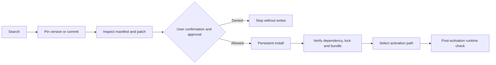

# dsh-agent-plugin-research

[简体中文](README.md) | English


An agent tool bridge that searches, pins, inspects, and confirms DSH community plugins before installation, then produces a verifiable activation plan.

> This is not a visual marketplace. It ships no settings page, client bundle, or Web route.

## 30-second quick start

Requirements: Node.js 22.19+ and DeepSeek Harness 0.1.0-rc.8+.

Download the pinned archive from Releases, then run from the download directory:

```powershell
dsh plugin --profile web add .\dsh-agent-plugin-research-0.5.1.tgz
```

From a source checkout, test before installing:

```powershell
.\verify-and-install.cmd
```

Load the plugin with an existing DSH lifecycle mechanism. Development environments may use visible `dsh-super-injector` tools; permanent bundle changes should use a supervised restart. This plugin never invokes activation or restart tools itself.

First verification prompt:

> Search for and inspect a suitable DSH plugin, but do not install it. Report its pinned identity, install scripts, bundle-patch risks, and recommended activation path.

After reviewing the report:

> Install the pinned version. Ask before every permanent write, verify profile registration afterward, and return an activation plan.

## Workflow



## Seven stable tools

| Tool | Purpose | Writes | Confirmation |
| --- | --- | --- | --- |
| `plugin_research_search` | Search GitHub, npm, private indexes, or the offline fallback | No | No |
| `plugin_research_inspect` | Inspect manifests, install scripts, and `cordis.patch.yml` risks | No | No |
| `plugin_research_list_installed` | List profile dependencies, runtime entries, and ordered bundle layers | No | No |
| `plugin_research_install` | Permanently install with pnpm and reconcile the bundle list | Yes | `confirm: true` plus the available approval service |
| `plugin_research_uninstall` | Permanently remove a dependency and reconcile the bundle list | Yes | `confirm: true` plus the available approval service |
| `plugin_research_verify` | Verify identity, lockfile, patch, and profile metadata | No | No |
| `plugin_research_activation_plan` | Detect agent-visible lifecycle capabilities and propose steps | No | No |

Tools are registered in a fixed order with fixed schemas. Optional plugins affect only the result of an explicit `activation_plan` call, never the model-request prefix.

## Installation location

| Layer | User-facing meaning |
| --- | --- |
| DSH profile | Authoritative dependency registration and bundle ordering, such as `~/.dsh/profiles/web` |
| Profile `node_modules` | Runtime package entry resolved by DSH |
| Source workspace | Separate only for `link:` / `file:` installations |
| pnpm store | Shared content cache, not source or activation location |

Output never assumes a drive letter, username, or global pnpm store location.

## Activation paths

| Path | Best for | Persistent | Restart |
| --- | --- | --- | --- |
| `dsh-super-injector` `dev_*` tools | Local development injection, unload, and reload | Depends on its workflow | Usually no |
| User `cordis.patch.yml` | Transactional configuration HMR for a package already resolvable by the profile | Yes | No when successful |
| `dsh-restart-resume` | Official backend/client bundle loading after a permanent install or removal | Yes | Yes, supervised |

Editing a patch does not download dependencies and cannot guess a plugin's id, name, or configuration shape. This plugin returns plans only; it does not wrap or silently invoke other tools.

## Security boundaries

- Install specs must be an exact npm version, immutable GitHub commit, or local `file:` path inside `allowedFileRoots`.
- Third-party packages may run install scripts. Inspect first, then separately review every requested `allowBuildPackages` entry.
- pnpm runs asynchronously without a shell; Windows launches its JavaScript entrypoint directly.
- Install and uninstall require explicit confirmation. When an approval channel exists, denial or unavailability prevents writes.
- `verify` proves metadata consistency only, not runtime services, Web loading, or native artifacts.
- GitHub authentication reads `GITHUB_TOKEN` or `GH_TOKEN` by default. Never put tokens in configuration, prompts, or issue reports.

## Configuration

`cordis.patch.yml` can define additional JSON indexes, the GitHub token environment-variable name, allowed local file roots, and pnpm behavior. Private indexes should return pinned, reviewable identities rather than presenting floating branches as immutable releases.

## Troubleshooting

| Symptom | Action |
| --- | --- |
| GitHub search is rate-limited | Set `GITHUB_TOKEN` / `GH_TOKEN`, or wait for the reported reset time; npm identity can still support read-only inspection |
| pnpm blocks build scripts | Review the reported packages and retry only with exact approved names in `allowBuildPackages` |
| Installation completed but no activation plan is returned | Run `plugin_research_verify`; dependency, lockfile, manifest, patch, and bundle layers must agree |
| `dev_*` or restart tools are absent | These are optional lifecycle capabilities; install the relevant plugin or choose an available path |
| A plugin appears to be “installed in the pnpm store” | The store is only a cache; trust profile registration and the profile `node_modules` resolution |
| A GitHub branch or npm latest tag is rejected | Use an immutable commit or exact version and inspect again |

## Development verification

```powershell
npm ci
npm test
npm pack --dry-run
```

CI runs the same tests and packaging check on Windows with Node.js 22.19. Include DSH/Node versions, the target profile, redacted tool output, and a minimal reproduction when reporting a problem.

## Support and community

Report plugin-specific problems in this repository's [Issues](https://github.com/Asteroid0449/dsh-agent-plugin-research/issues). Send confirmed Harness-level problems to [DeepSeek Harness Discussions](https://github.com/deepseek-ai/deepseek-harness/discussions). Read the [contributing guide](https://github.com/Asteroid0449/dsh-agent-plugin-research/blob/main/CONTRIBUTING.md) before contributing and the [security policy](https://github.com/Asteroid0449/dsh-agent-plugin-research/blob/main/SECURITY.md) for security reports.

## Acknowledgements and project status

This is an independently maintained community plugin for DeepSeek Harness. It is not an official DeepSeek product and is not sponsored, endorsed, or certified by DeepSeek. We thank the [DeepSeek Harness](https://github.com/deepseek-ai/deepseek-harness) team for the plugin platform, bundle mechanism, and development documentation.

Thanks to [dsh-super-injector](https://github.com/yjh051108/dsh-super-injector) for documenting its `dev_*` development lifecycle tools and runtime-injection practices. When those tools are visible to the current agent, this plugin recognizes them as an optional development activation path and may recommend the appropriate next step; it does not invoke them on the user's behalf, bundle, or depend on dsh-super-injector. Its discovery, review, and persistent-installation features do not require that project.

The names and trademarks of DeepSeek Harness, DeepSeek, and other third-party projects remain the property of their respective owners. They are referenced here solely to identify compatibility and project relationships.

## License

[MIT](LICENSE)
