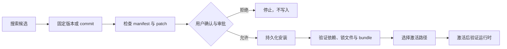

# dsh-agent-plugin-research

简体中文 | [English](README.en.md)


让 Agent 在安装 DSH 社区插件前先完成搜索、固定版本、风险检查和用户确认，并在安装后给出可验证的激活方案。

> 本项目是 Agent 工具桥，不是面向人的可视化插件市场。它没有设置页、客户端 bundle 或 Web 路由。

## 30 秒快速开始

要求：Node.js 22.19+、DeepSeek Harness 0.1.0-rc.8+。

从 Releases 下载当前固定版本的压缩包，在下载目录运行：

```powershell
dsh plugin --profile web add .\dsh-agent-plugin-research-0.5.1.tgz
```

如果仓库源码已经在本机，也可以先测试再安装：

```powershell
.\verify-and-install.cmd
```

安装完成后，用已有的 DSH 生命周期方式加载插件：开发态可使用可见的 `dsh-super-injector` 工具；正式 bundle 变更使用受监督重启。插件不会自行调用任何激活或重启工具。

首次验证可直接告诉 Agent：

> 搜索并审查一个适合 DSH 的插件，先不要安装。列出版本身份、安装脚本、bundle patch 风险和建议的激活方式。

确认报告后再说：

> 安装刚才固定的版本；在任何永久写入前向我确认，安装后验证 profile 登记并给出激活方案。

## 工作流程



## 七项固定工具

| 工具 | 作用 | 写入 | 是否需要确认 |
| --- | --- | --- | --- |
| `plugin_research_search` | 搜索 GitHub、npm、私有索引或离线精选表 | 否 | 否 |
| `plugin_research_inspect` | 检查 manifest、安装脚本和 `cordis.patch.yml` 风险 | 否 | 否 |
| `plugin_research_list_installed` | 列出 profile 依赖、运行入口和有序 bundle 层 | 否 | 否 |
| `plugin_research_install` | 用 pnpm 永久安装并协调 bundle 清单 | 是 | `confirm: true`，且使用可用的审批服务 |
| `plugin_research_uninstall` | 永久移除依赖并协调 bundle 清单 | 是 | `confirm: true`，且使用可用的审批服务 |
| `plugin_research_verify` | 验证包身份、锁文件、patch 和 profile 层 | 否 | 否 |
| `plugin_research_activation_plan` | 检测当前 Agent 可见能力并生成激活步骤 | 否 | 否 |

工具始终以固定顺序和固定 schema 注册。可选插件是否存在只改变显式调用 `activation_plan` 后的结果，不改变模型请求前缀。

## 安装位置：谁负责什么

| 层 | 普通用户应如何理解 |
| --- | --- |
| DSH profile | 权威的依赖登记和 bundle 顺序，例如 `~/.dsh/profiles/web` |
| profile `node_modules` | DSH 实际解析到的运行时包入口 |
| 源码工作区 | 只在 `link:` / `file:` 安装时单独存在 |
| pnpm store | 共享内容缓存，不是插件源码目录，也不是激活位置 |

输出不会假设固定盘符、用户名或全局 pnpm store 位置。

## 三种激活路径

| 路径 | 适合场景 | 持久化 | 是否重启 |
| --- | --- | --- | --- |
| `dsh-super-injector` 的 `dev_*` 工具 | 本地开发、热注入、卸载与重载 | 取决于其开发工作流 | 通常不需要 |
| 用户 `cordis.patch.yml` | 已能从 profile 解析的包，进行事务化配置 HMR | 是 | 成功时不需要 |
| `dsh-restart-resume` | 永久 bundle 安装/移除后正式加载后端与前端 | 是 | 是，受监督 |

写 patch 不会下载依赖，也不能猜测插件的 id、name 或配置结构。本插件只给方案，不包装或偷偷调用其他工具。

## 安全边界

- 安装仅接受精确 npm 版本、固定 GitHub commit，或位于 `allowedFileRoots` 内的本地 `file:` 路径。
- 第三方包可能执行安装脚本；应先 inspect，再单独审查需要放行的 `allowBuildPackages`。
- pnpm 使用无 shell 的异步子进程；Windows 直接运行 pnpm 的 JavaScript 入口。
- 安装和卸载必须显式确认；审批通道存在时，审批失败或不可用会拒绝写入。
- `verify` 只证明安装元数据一致，不证明运行时服务、Web 客户端或原生产物已经工作。
- GitHub 认证默认读取 `GITHUB_TOKEN` 或 `GH_TOKEN`；不要把 token 写进配置、提示词或问题报告。

## 配置

`cordis.patch.yml` 可配置额外 JSON 索引、GitHub token 环境变量名、本地文件白名单根目录和 pnpm 行为。私有索引应返回固定且可审查的包身份，不应把浮动分支伪装成已固定版本。

## 常见问题

| 现象 | 处理 |
| --- | --- |
| GitHub 搜索被限流 | 设置 `GITHUB_TOKEN` / `GH_TOKEN`，或等待结果报告的重置时间；可使用 npm 身份继续只读检查 |
| pnpm 阻止构建脚本 | 审查失败结果中的包名，只把确认过的精确名称放入 `allowBuildPackages` 后重试 |
| 安装成功但没有激活方案 | 先运行 `plugin_research_verify`；依赖、锁文件、manifest、patch 与 bundle 必须一致 |
| 看不到 `dev_*` 或重启工具 | 这些是可选生命周期能力；安装相应插件或选择当前环境可用的路径 |
| 插件“装在 pnpm store” | store 只是缓存；以 profile 登记和 profile `node_modules` 解析结果为准 |
| GitHub 分支或 npm latest 被拒绝 | 改用固定 commit 或精确版本，重新 inspect 后再安装 |

## 开发验证

```powershell
npm ci
npm test
npm pack --dry-run
```

CI 在 Windows + Node.js 22.19 上执行同样的测试与打包检查。提交问题时请附 DSH/Node 版本、目标 profile、已脱敏的工具结果和最小复现步骤。

## 反馈与社区

插件问题请提交到本仓库 [Issues](https://github.com/Asteroid0449/dsh-agent-plugin-research/issues)。确认属于 Harness 上游的问题，再前往 [DeepSeek Harness Discussions](https://github.com/deepseek-ai/deepseek-harness/discussions)。贡献前请阅读 [贡献指南](https://github.com/Asteroid0449/dsh-agent-plugin-research/blob/main/CONTRIBUTING.md)，安全问题请阅读 [安全策略](https://github.com/Asteroid0449/dsh-agent-plugin-research/blob/main/SECURITY.md)。

## 致谢与项目状态

本项目是独立维护的 DeepSeek Harness 社区插件，并非 DeepSeek 官方产品，也未获得 DeepSeek 的背书、合作或认证。感谢 [DeepSeek Harness](https://github.com/deepseek-ai/deepseek-harness) 团队提供插件平台、bundle 机制与开发文档。

感谢 [dsh-super-injector](https://github.com/yjh051108/dsh-super-injector) 项目公开其 `dev_*` 开发生命周期工具与运行时注入实践。本插件仅在这些工具对当前 Agent 可见时，将其识别为可选的开发态激活路径并给出建议；不会代替用户调用、打包或依赖 dsh-super-injector。插件的搜索、审查和持久化安装能力不以它为前提。

DeepSeek Harness、DeepSeek 及其他第三方项目的名称与商标归各自权利人所有；本文提及这些名称仅用于说明兼容性和项目关系。

## 许可证

[MIT](LICENSE)
